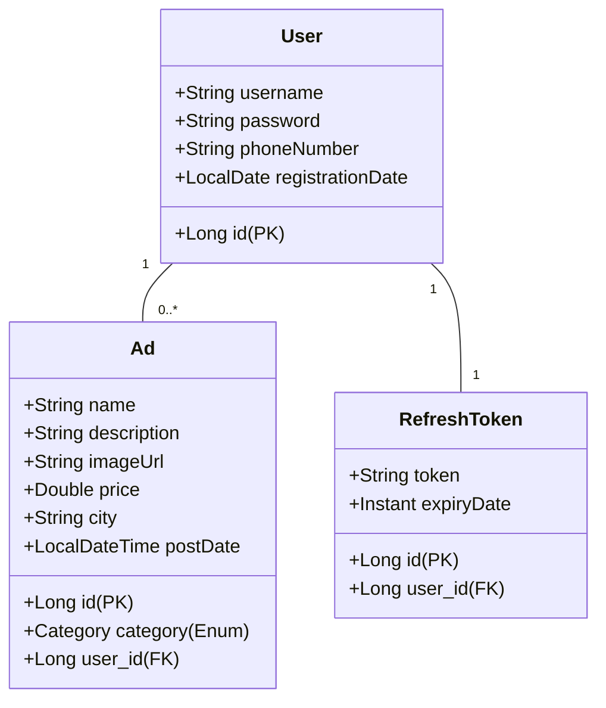

# Web Ads 
Simple web application for online ads. Developed as a task for internship.

<p align="center">
  
  
</p>


---

## ✨ Key Features

-   **Full-Stack Architecture:** A complete solution with a Spring Boot backend and a React (TypeScript) frontend.
-   **JWT Authentication & Authorization:** Secure user registration and login system using JSON Web Tokens, including a **Refresh Token strategy** for seamless user sessions.
-   **Complete CRUD Operations:** Users can create, read, update, and delete their own ads.
-   **Ad Filtering & Pagination:** Filtering system on the homepage, allowing users to search by name, category, and price range, with server-side pagination.
-   **Access Control:** Strict ownership checks ensure users can only modify or delete their own ads.
-   **Responsive & Modern UI/UX:** A clean, intuitive, and fully responsive user interface built with Ant Design, providing a great experience on both desktop and mobile devices.
-   **Database Seeding:** An automated seeder populates the database with realistic mock data on startup.
-   **Dockerized Environment:** The entire application (Backend, Frontend, Database) is containerized using Docker.
-   **Performance & Security Optimizations:**
    -   **Rate Limiting:** Using Token Bucket algorithm (Bucket4j) in Spring Boot.
    -   **Nginx Server:** Serves the frontend, acts as a reverse proxy, and includes optimizations like Gzip compression and browser caching for static assets.
    -   **CORS & Security Headers:** Properly configured CORS policy and essential security headers.

---

## 📊 Class Diagram



---

## 🛠️ Tech Stack & Architecture

### Backend
-   **Framework:** Spring Boot
-   **Language:** Java
-   **Security:** Spring Security (JWT Authentication with Refresh Tokens)
-   **Database:** Spring Data JPA (Hibernate) with PostgreSQL
-   **Data Fetching:** Dynamic query building with JPA Specifications
-   **API:** RESTful API architecture
-   **Testing:** JUnit & Mockito for Unit Testing
-   **Dependency Management:** Maven

### Frontend
-   **Framework:** React (with TypeScript)
-   **UI Library:** Ant Design
-   **API Communication:** Axios

### DevOps
-   **Containerization:** Docker
-   **Web Server:** Nginx

---

## 🚀 Getting Started

Follow these instructions to get the project up and running on your local machine.

### Prerequisites

-   Docker
-   Git

### Installation & Setup

1.  **Clone the repository:**
    ```bash
    git clone https://github.com/cornenkiV/web-ads.git
    cd web-ads
    ```

2.  **Configure Environment Variables:**
    -   Create a `.env` file in the root of the project by copying the example file:
        ```bash
        cp .env.example .env
        ```
    -   Open the `.env` file and review the variables. For a standard local setup, the default values should work.


3.  **Build and Run with Docker Compose:**
    -   From the root of the project, run the following command:
        ```bash
        docker-compose up --build
        ```
    -   The `--build` flag ensures that Docker images are rebuilt from scratch. The initial build may take a few minutes.

4.  **Access the Application:**
    -   Frontend Application: **http://localhost:3000**
    -   Backend API: **http://localhost:8080**

### Seeder Information

-   If `DB_SEED` is set to `true`, the database will be populated with **10 users** and **100 ads**.
-   The password for all seeded users is: `password`

### Stopping the Application

-   Press `Ctrl + C` in the terminal where `docker-compose` is running.
-   To remove the containers and network run: `docker-compose down`

---